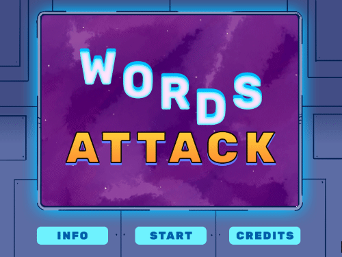

# words-attack

link to deployed site [HERE](https://words-attack.netlify.app/)

## Space Shooter Word Puzzle

Like word jumbles?, Like space shooters? Then this is the game for you!

## Intro

Words Attack is a a Word Jumble, Space Shooter game made in PhaserJS. You play as a ship moving through levels by destroying enemy letters. The enemy letters need to be shot in unjumbled order to spell out the word to defeat them and move to the next level. Hitting the wrong enemy letter will hurt you. You also need to avoid enemy fire by dodging or using your shield. Oh yeah, and you have to do that in 2 minutes or less or else it is game over.

## Controls

#### WASD
Movement: up, down, left, right

#### SPACEBAR
Shield: Drains Shield bar, regenerates when you release the spacebar.

#### LEFT MOUSE BUTTON
Shoot: Fires a bullet towards cursor position.

## Things Learned

This is my second game in Phaser JS and This time around I started using the GameObject factory more properly. I also started passing down more properties into the objects. 

I learned that it is best to have all your object code inside of the objects own PreUpdate funciton. I learned that you need to pass down delta and time into the PreUpdate function and super delta and time to fix the overwriting of it by re declaring it.

I also learned that it is important where you declare the physics property on objects or groups. It is generally better to add regular objects to physics groups and add collisions to the group instead of every individual object in the group.

*Tech used: PaserJS, HTML, CSS*

## Local Set Up

1. clone repo: `git clone https://github.com/Jalcantara88/words-attack.git`

2. install from package.json: `yarn add`

3. start development environment (uses parcel): `yarn start`